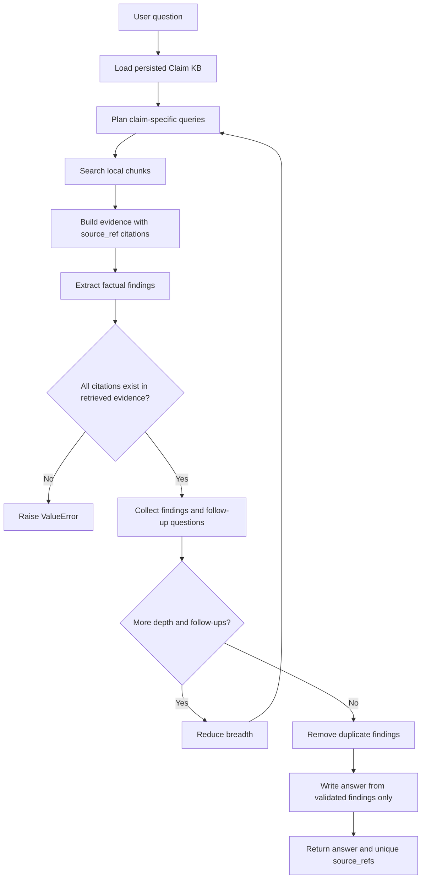

# Knowledge Agent

Proof-of-concept backend modules for turning claim material into structured,
retrievable knowledge.

This repo should stay simple while the shape of the product is still being
discovered. Keep module boundaries clear, make behavior explicit, and avoid
hidden fallbacks or speculative abstractions. See [AGENTS.md](AGENTS.md) for the
working code mantra.

## Modules

| Module | Status | Purpose |
| --- | --- | --- |
| [`ingest`](ingest/README.md) | Current | Ingests a combined claim PDF or a folder of separate PDFs into a structured, searchable claim knowledge base. |
| `research` | Current | Runs cited, fixed-depth research over one persisted claim knowledge base. |

## Folder Structure

```text
.
  AGENTS.md
  README.md
  pyproject.toml
  infrastructure/
    config.py
    errors.py
    responses.py
    runtime.py
  ingest/
    README.md
    *.py
  research/
    agent.py
    bootstrap.py
    cli.py
    llm.py
    schemas.py
  examples/
    ingest/
      README.md
      sample_input/
      sample_output/
  evals/
    azure_research.json
  tests/
    contract/
      test_llm_providers.py
    infrastructure/
      test_*.py
    ingest/
      test_*.py
      conftest.py
    research/
      test_*.py
```

Generated and local-only folders such as `.venv/`, `.pytest_cache/`,
`*.egg-info/`, `__pycache__/`, and `data/claims/` are ignored.

Provider configuration, OpenAI-compatible client construction, portable
Responses API calls, resource cleanup, logging, and normalized errors live under
`infrastructure/`. Claim and research modules keep their prompts,
schemas, orchestration, and validation rules.

Both modes use the official `openai` Python SDK and the same
`client.responses.parse()` path. `KNOWLEDGE_AGENT_MODE` selects the complete
runtime profile; provider selection does not appear in Claim KB or research
business logic.

## Claim KB

[`ingest`](ingest/README.md) accepts either one combined claim PDF or a
folder of already separate PDFs. It runs OCR, prepares ordered documents,
extracts metadata, and chunks text. `home` mode uses keyword retrieval without
embeddings. `work` mode embeds chunks with Snowflake Cortex and stores vectors
in Chroma.

Synthetic example output is available in
[`examples/ingest`](examples/ingest/README.md). These files are hand-written
documentation examples and read-only test input, not runtime output.

Run ingestion with:

```powershell
python -m ingest.cli --claim-id CLM-001 --pdf-path data/input/scanned_claim.pdf
```

For separate document PDFs:

```powershell
python -m ingest.cli `
  --claim-id PROP-B2B-2026-0417 `
  --folder-path examples/ingest/sample_input
```

## Research Agent

`research` answers one question against one persisted Claim KB folder. It
plans local searches, extracts cited findings, follows up for a fixed depth, and
writes an answer using only those findings. It does not use web search.
Retrieval is local keyword search, so it works with both Snowflake-embedded and
keyword-only claim outputs.



Set `KNOWLEDGE_AGENT_MODE` to `home` or `work`. Home uses `OPENROUTER_MODEL`,
`OPENROUTER_API_KEY`, and key-based Document Intelligence. Work uses
`AZURE_OPENAI_MODEL`, an Azure AI Projects endpoint, a named Document
Intelligence project connection, interactive browser authentication, and
Snowflake. Copy `.env.example` to `.env`; the `.env` file is ignored by Git.

Run research with:

```powershell
python -m research.cli `
  --claim-path examples/ingest/sample_output `
  --question "What repairs were invoiced?"
```

The answer is followed by a `Sources:` section containing the exact
`source_ref` values from retrieved claim chunks.

Research logs append to the ignored file `logs/research.log`. The default
`INFO` level records research layers, queries, evidence counts/source refs,
finding counts, provider status, token usage, and latency without OCR evidence
text. Use `--log-level DEBUG` to additionally record exact LLM prompts and
complete parsed outputs:

```powershell
python -m research.cli `
  --claim-path examples/ingest/sample_output `
  --question "What repairs were invoiced?" `
  --log-level DEBUG
```

DEBUG logs may contain claim text, findings, and final answers. No log level
records API keys, bearer tokens, or authentication headers.

Run tests with:

```powershell
python -m pytest
```

Live provider contracts are opt-in:

```powershell
$env:RUN_OPENROUTER_CONTRACT_TEST="1"
python -m pytest -m live_openrouter tests/contract/test_llm_providers.py

$env:RUN_AZURE_CONTRACT_TEST="1"
python -m pytest -m live_azure tests/contract/test_llm_providers.py
```

The Azure run includes the small research golden dataset under `evals/`.
Work-mode ingestion opens a browser for Microsoft Entra authentication:

```powershell
$env:KNOWLEDGE_AGENT_MODE="work"
python -m ingest.cli `
  --claim-id CLM-WORK-SMOKE `
  --folder-path examples/ingest/sample_input
```
